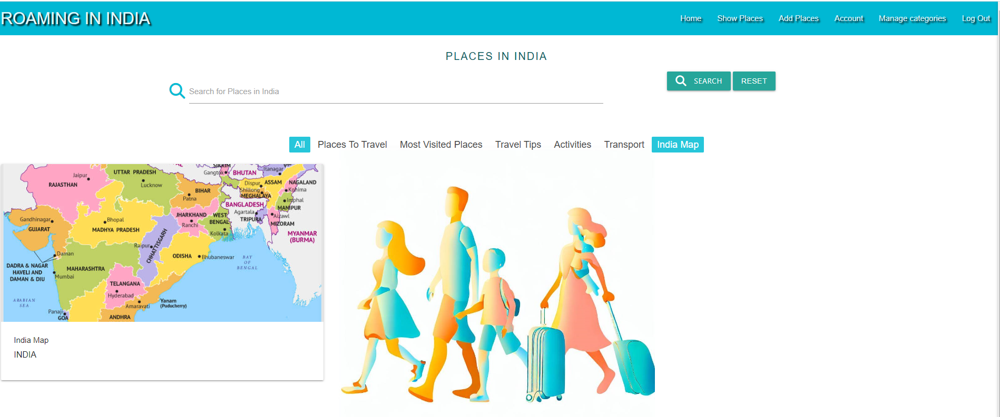

# Roaming-In-India Manual Testing Page

#### Test Scenario :-
 * Home
     All links in navbar takes you to the correct pages
     Button "Show Places" takes you to the Places page
     All links to social media platforms in footer opens in a new tab window
     Hover effect on links in navbar
     Hover effect on links in footer
 * Places
    Search function finds the correct Places and Information anout the pages.
    "Reset" button clears the search bar
    Links to the different categories displays the correct Places.
 * Sign Up
    Input fields displays the text to the user and hides the password
    User being added to the database upon registration and redirects to account page
    Error message "Username already exists" displays if you try to type in an already existing username
    Link "Log In" leads to Log In page
 * Log In
    Input fields displays the text to the user and hides the password
    "Log In" button redirects to account page
    Link "Register Now" leads to Sign Up page
 * Account
    Users own Details about Places appears on their account page
    "Add Places" button redirects to add Place page
    "Edit" button redirects to edit Place page
    "Delete" button opens confirmation tag
    "Yes" on warning dialogue box message deletes the Place Or Information from database
    "No" on the warning message closes the dialogue box without any changes being made
 * Log Out
    User being logged out from Account and redirected to Log In page
 * Add Places
    All fields in form are being filled out as expected
    Submitting the form will not work without all fields being filled out
    If filled out correcly places/information are being added to the database and displays on account page and Place page
    Locations are being displayed in a list
    Description are being displayed 
    "Cancel" button takes you back to account page
 * Edit Place
    Form is prefilled with the previous information
    "Cancel" button takes you back to Place page
    "Update places" button updates Place in database
 * Manage Categories
    Only visible when Admin is logged in
    All tabs open and displays an "edit" and "delete" button
    "Edit" button redirects to edit category page
    "Add new category" button redirects to add category page
    "Delete" button opens confirmation warning message dialogue box 
    "Yes" on warning message dialogue box deletes the category from database
    "No" on warning message dialogue box  close the modal without any changes being made
 * Edit Category
    The category name is prefilled in the input field
    "Cancel" button takes you back to manage categories page
    "Update category" button updates category in database
 * Add Category
    Submitting the form will not work without the field being filled out
    "Cancel" button takes you back to manage categories page
    Category is being added to database and displays on managae category page and as an option for users when they add a new Place.

## MongoDB Database Collection:

1.Database Categories List/Chart

2.Database added Places List/Chart

## Validator Testing:

----------------------------

## Light House:

## Manual Testing

### HOME PAGE

* Open the URL link https://roaming-in-india.herokuapp.com/. The homepage opens correclty with background images and navigation bar. 
-----------------------------
### SHOW PLACES PAGE

* Clicking on the show pages link, takes me to places in India page, this shows the search bar, with the places cards with pictures. 
 

* Clicking on the places card, flips the cards over to show a descriptions.
 

* Clicking on Places to travel, opens up a page with two cards on this.
 

* Clicking on Most Visited places, opens up a page with cards on this, showing the most visited places. 
 

* Clicking on the travel tips button, opens up a page with cards on this, showing a card with an Indian Flag with Travel tips on the rear.
 

* Clicking on the Actvities button, opens up a page with cards on this, showing different activities at different locations.
 

* Clicking on the transport button, opens up a page with cards on this, showing different modes of transport information at different locations.

* Clicking on the India Map button, opens up a page with a card on this, showing information about the different states of India.
 
----------------------------
### SEARCH BAR 

* When searching using the search bar, typing in Mumbai, brings up two results. 

---------------------------
### USER SIGN UP PAGE

* After clicking sign up, it takes to the sign up page with username and password. 
 

* After inputting details, a message appears saying registration sucessful.

* Once registered sucessfully, it shows the user name and add places button to start editing. 

---------------------------
### USER LOGIN AND OFF PAGE

* After clicking log in button takes you to the login page, after logging out, a message appears in red, saying that you have been locked out

---------------------------
### ADD PLACES

* Clickling on add places, a card comes up with the following field, category, place name, location, description and add image.

* When clicking on categories, a drop down menu appears with different fields to choose from.

* once a category is selected, filled the form in with text.

* Once clicked on add place, a message appears in red advising that the place has been added sucessfully 

* On the next page a card appears with two buttons edit and delete. If delete is clicked then a dialouge box is opened if you are sure you want to delete with a yes or no option. Yes removes the lisitng and no takes you back to the card page. 
* 
------------------------------
### Edit Places Page

* If clicking on edit, it takes on the edit page and you can change the category, description and location

* Once sucessfully edited, a red message appears advising the editied card has been updated. 
--------------------------------
### Delete Places Page

* If clicked on the deleted button and clicked on yes, then a red message appears saying that the added place has been deleted. 

--------------------------------
### Add Category Page

* In order to add categories, only admin can do this after logging in. Click on manage categories and then click add button. 

* This takes you to a new page which has two options, to cancel or add a new category. If press cancel this will not add the category, but if adding and clicking the button on the next page a dialouge will appear advising that the new category is added and then will appear in the list of categories. 

* After clicking managing categegories and then clicking on the drop down of the category, two options appear, edit and delete. Clicking edit takes you the editing page. 

--------------------------------
### Delete Category Page

* Clicking delete category, a dialogue box appears advising if you want to permantly delete this with a yes or no option. Clicking yes deletes the entry and clicking no takes you bakc to the manage categories page. 

-------------------------------
 ### ERROR PAGE 

 
 * If a page isnt found then the error page comes up. 

### While doing testing I found one error on the account page. When the user added the places, it wasnt showing on their account as added places. 
This was ocurring as a code bug 
* @app.route("/account", methods=["GET", "POST"])    
def account():
    if is_logged_in():
        user = mongo.db.users.find_one({"username": session["user"]})
        places = list(mongo.db.places.find({"created_by": user["username"]}))
        return render_template("account.html", user=user, places=places)
    return redirect(url_for("login")) 
    
   It was a spelling mistake on Mongo.db.places, which has now been resolved. 

