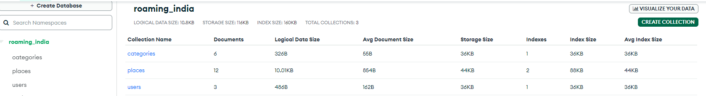

# Roaming-In-India Manual Testing Page

## Validator Testing:

## Light House:

## Manual Testing
#### Test Scenario :-
 * Home
     All links in navbar takes you to the correct pages
     Button "Show Places" takes you to the Places page
     All links to social media platforms in footer opens in a new tab window
     Hover effect on links in navbar
     Hover effect on links in footer
 * Places
    Search function finds the correct Places and Information anout the pages.
    "Reset" button clears the search bar
    Links to the different categories displays the correct Places.
 * Sign Up
    Input fields displays the text to the user and hides the password
    User being added to the database upon registration and redirects to account page
    Error message "Username already exists" displays if you try to type in an already existing username
    Link "Log In" leads to Log In page
 * Log In
    Input fields displays the text to the user and hides the password
    "Log In" button redirects to account page
    Link "Register Now" leads to Sign Up page
 * Account
    Users own Details about Places appears on their account page
    "Add Places" button redirects to add Place page
    "Edit" button redirects to edit Place page
    "Delete" button opens confirmation modal
    "Yes" on modal deletes the Place Or Information from database
    "No" on modal close the modal without any changes being made
 * Log Out
    User being logged out from Account and redirected to Log In page
 * Add Places
    All fields in form are being filled out as expected
    Submitting the form will not work without all fields being filled out
    If filled out correcly recipe is being added to the database and displays on account page and Place page
    Location are being displayed in a list
    Desctription are being displayed in a ordered list if you press enter after every step
    "Cancel" button takes you back to account page
 * Edit Place
    Form is prefilled with the previous information
    "Cancel" button takes you back to Place page
    "Update recipe" button updates Place in database
 * Manage Categories
    Only visible when Admin is logged in
    All tabs open and displays an "edit" and "delete" button
    "Edit" button redirects to edit category page
    "Add new category" button redirects to add category page
    "Delete" button opens confirmation modal
    "Yes" on modal deletes the category from database
    "No" on modal close the modal without any changes being made
 * Edit Category
    The category name is prefilled in the input field
    "Cancel" button takes you back to manage categories page
    "Update category" button updates category in database
 * Add Category
    Submitting the form will not work without the field being filled out
    "Cancel" button takes you back to manage categories page
    Category is being added to database and displays on managae category page and as an option for users when they add a new Place.

