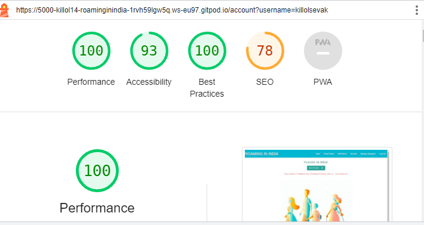
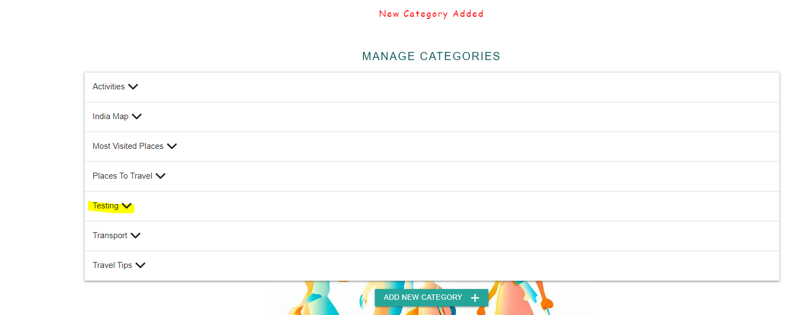

# Roaming-In-India Manual Testing Page

#### Test Scenario :-
 * Home
     All links in navbar takes you to the correct pages
     Button "Show Places" takes you to the Places page
     All links to social media platforms in footer opens in a new tab window
     Hover effect on links in navbar
     Hover effect on links in footer
 * Places
    Search function finds the correct Places and Information anout the pages.
    "Reset" button clears the search bar
    Links to the different categories displays the correct Places.
 * Sign Up
    Input fields displays the text to the user and hides the password
    User being added to the database upon registration and redirects to account page
    Error message "Username already exists" displays if you try to type in an already existing username
    Link "Log In" leads to Log In page
 * Log In
    Input fields displays the text to the user and hides the password
    "Log In" button redirects to account page
    Link "Register Now" leads to Sign Up page
 * Account
    Users own Details about Places appears on their account page
    "Add Places" button redirects to add Place page
    "Edit" button redirects to edit Place page
    "Delete" button opens confirmation tag
    "Yes" on warning dialogue box message deletes the Place Or Information from database
    "No" on the warning message closes the dialogue box without any changes being made
 * Log Out
    User being logged out from Account and redirected to Log In page
 * Add Places
    All fields in form are being filled out as expected
    Submitting the form will not work without all fields being filled out
    If filled out correcly places/information are being added to the database and displays on account page and Place page
    Locations are being displayed in a list
    Description are being displayed 
    "Cancel" button takes you back to account page
 * Edit Place
    Form is prefilled with the previous information
    "Cancel" button takes you back to Place page
    "Update places" button updates Place in database
 * Manage Categories
    Only visible when Admin is logged in
    All tabs open and displays an "edit" and "delete" button
    "Edit" button redirects to edit category page
    "Add new category" button redirects to add category page
    "Delete" button opens confirmation warning message dialogue box 
    "Yes" on warning message dialogue box deletes the category from database
    "No" on warning message dialogue box  close the modal without any changes being made
 * Edit Category
    The category name is prefilled in the input field
    "Cancel" button takes you back to manage categories page
    "Update category" button updates category in database
 * Add Category
    Submitting the form will not work without the field being filled out
    "Cancel" button takes you back to manage categories page
    Category is being added to database and displays on managae category page and as an option for users when they add a new Place.

## MongoDB Database Collection:

1.Database Categories List/Chart

2.Database added Places List/Chart

## Validator Testing:

----------------------------

## Light House:

## Manual Testing

### HOME PAGE

* Open the URL link https://roaming-in-india.herokuapp.com/. The homepage opens correclty with background images and navigation bar. 
-----------------------------
### SHOW PLACES PAGE

* Clicking on the show pages link, takes me to places in India page, this shows the search bar, with the places cards with pictures. 

* Clicking on the places card, flips the cards over to show a descriptions.

* Clicking on Places to travel, opens up a page with two cards on this.

* Clicking on Most Visited places, opens up a page with cards on this, showing the most visited places. 

* Clicking on the travel tips button, opens up a page with cards on this, showing a card with an Indian Flag with Travel tips on the rear.

* Clicking on the Actvities button, opens up a page with cards on this, showing different activities at different locations.

* Clicking on the transport button, opens up a page with cards on this, showing different modes of transport information at different locations.

* Clicking on the India Map button, opens up a page with a card on this, showing information about the different states of India.
----------------------------
### SEARCH BAR 

* When searching using the search bar, typing in Mumbai, brings up two results. 

---------------------------
### USER SIGN UP PAGE

* After clicking sign up, it takes to the sign up page with username and password. 

* After inputting details, a message appears saying registration sucessful.

* Once registered sucessfully, it shows the user name and add places button to start editing. 

---------------------------
### USER LOGIN AND OFF PAGE

* After clicking log in button takes you to the login page, after logging out, a message appears in red, saying that you have been locked out

---------------------------
### ADD PLACES

* 

------------------------------
### Edit Places Page

--------------------------------
### Delete Places Page

--------------------------------
### Add Category Page

--------------------------------
### Delete Category Page

-------------------------------
 ### ERROR PAGE 

